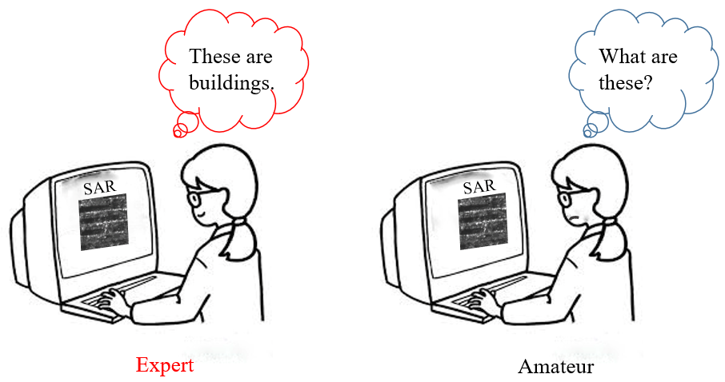
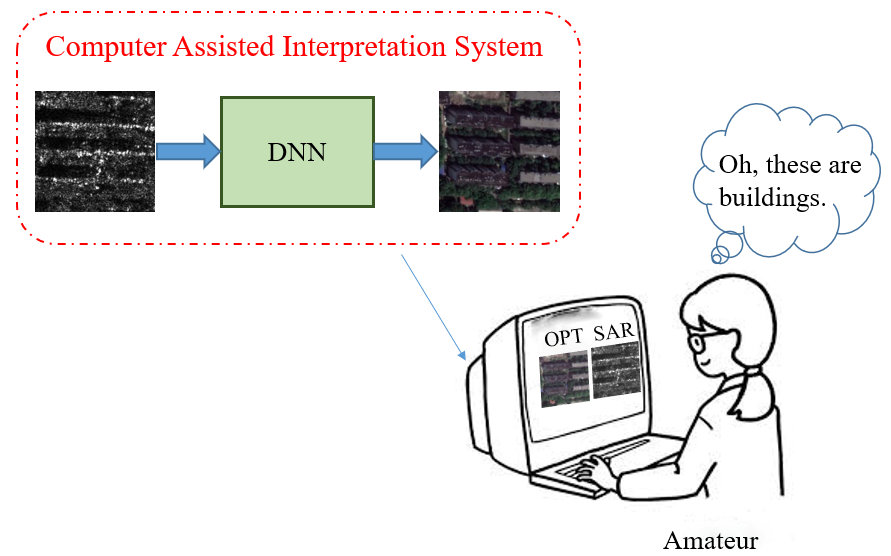
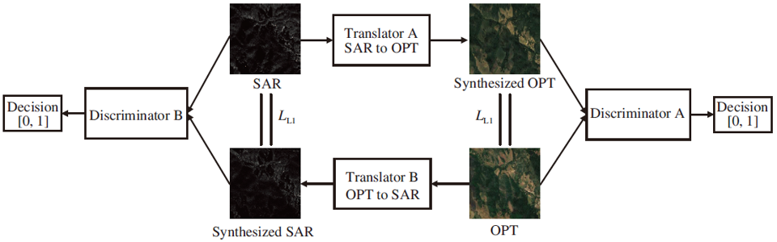
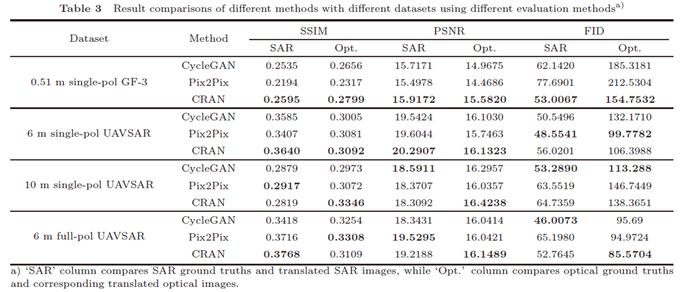

# CRAN

## Purpose

Owing to its distinct imaging mechanism and the complex electromagnetic (EM) wave scattering process, SAR (Synthetic Aperture Radar) exhibits very different imaging features from optical images. Some basic differences between SAR images and natural optical images are summarized in Table S1. Human’s visual system is adapted to the interpretation of optical images. SAR images are difficult to be interpreted by ordinary people. Although SAR images contain rich information about targets and scenes, such as geometric structure and material property, they can only be interpreted by well-trained experts.

The major objective of this work is to develop a deep learning application with large amount of coregistered SAR and optical images where SAR images can be translated to optical images and vice versa. The translated optical image can then be used in assisted interpretation of SAR image by ordinary people.

## Network Structure

The proposed framework is shown below. It has two reciprocal directions of translation, i.e., SAR to optical and optical to SAR. Each direction consists of two adversarial deep networks, i.e., a multiscale convolutional encoder-and-decoder network as the translator vs. a convolutional network as the discriminator.

The following figure shows the architecture and parameters of the translator network, which is named as ***cascaded-residual adversarial network***, abbreviated ***CRAN***. It follows the main structure of U-Net and Pix2Pix with certain modifications.

A conventional binary classification loss is employed to train the discriminator.

## Different Network Structure

To evaluate the performance of the proposed method in the context of existing image translation approaches, here, we compare it with widely-used CycleGAN and Pix2Pix using the 0.51m GF-3 dataset. These two networks are often used for image translation in the optical image domain, and as a benchmark for the experiment comparison. Note that the CycleGAN implemented here shares the same network structure with Pix2Pix, but is trained with the cyclic loop strategy. In order to ensure the fairness of comparison, the discriminators and the receptive fields of the generators are the same. The number of the generators’ layers and that of the total trainable parameters are the same.

## Terrain Segmentation & Aircraft Synthesis

This section is mainly about practical applications of CRAN. We make a contrastive experiment: (1) straightforwardly segment SAR images into regions, (2) convert SAR images to optical ones and then segment optical images. In our early work, we registered SAR and optical images, and annotated them. Before the experiment, we divide the whole dataset into three parts, training, validation and test data, and augment each seperately to improve the pixel ratio of buildings. For the scheme 1, we train pairs of SAR images and segmentation maps using the pretrained DeepLabv3+ model.

We acquire the appropriate amount of TerraSAR-X airport data with good registration and use CRAN for training. The selected scene is located in the aircraft cemetery, and
the number and types of airplanes are large. The translated images still seem to be sufficient for the task of target recognition.

## Requirements

Tensorflow version ==1.13.0 is used.

## Reference

> Reciprocal translation between SAR and optical remote sensing images with cascaded-residual adversarial networks. SCIENCE CHINA Information Sciences, Doi: 10.1007/s11432-020-3077-5.